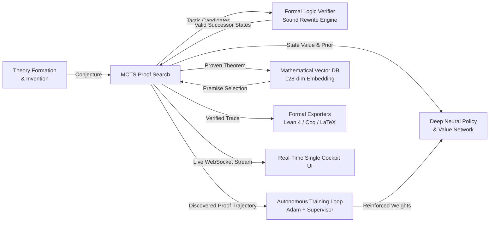

# Axiomatic

> Autonomous Neurosymbolic Mathematical Discovery Engine with Real-Time Interactive Command Center.

Axiomatic is a high-performance mathematical reasoning system written in Rust. It pairs formal first-order logic verification and structural Peano induction with deep neural Monte Carlo Tree Search (MCTS), closed-loop self-play reinforcement learning, vector premise retrieval, and formal proof certification (Lean 4, Coq, LaTeX).

---

## Architectural Overview



---

## Core Capabilities

### 1. Multi-Domain Sound Formal Logic Kernel
- **Abstract Algebra**: Groups, rings, semigroups, commutativity, associativity, additive/multiplicative identities, inverses, distribution.
- **Boolean Propositional Logic**: De Morgan duality, double negation elimination, boolean absorption, idempotence, excluded middle, boolean resolution.
- **Symbolic Calculus**: Linearity of differentiation, product rule ($D(u \cdot v) = D(u)v + uD(v)$), sum rule, constants.
- **Set Theory**: De Morgan laws on sets, distributive intersections/unions, universal/empty set identities, relative complements.
- **Peano Structural Induction**: Automated base case $(P(0))$ and inductive step $(P(k) \implies P(S(k)))$ decomposition and goal synthesis.

### 2. Deep Policy-Value Monte Carlo Tree Search (MCTS)
- Modified AlphaZero/AlphaProof PUCT search algorithm:
  $$U(s, a) = c_{\text{puct}} \cdot P(s, a) \cdot \frac{\sqrt{N(s)}}{1 + N(s, a)}$$
- Continuous online self-play training loop with mini-batch Adam optimization and gradient clipping.
- **Training Supervisor**: Automatic learning rate decay on loss plateaus and snapshot divergence rollback.

### 3. Continuous Autonomous Discovery & Theory Formation
- Autonomous mathematical conjecture synthesizer with non-triviality filters (Shannon entropy $\ge 4.0$).
- Vector database embedding ($128$-dimensional semantic state representation) for sublinear semantic lemma retrieval and premise selection.

### 4. Certified Formal Exporter & Lean 4 Validator
- Native translation of proven deduction graphs into verified formal languages:
  - **Lean 4** syntax (`theorem ... := by rw [...] ; rfl`)
  - **Coq** proof scripts (`Theorem ... Proof. rewrite ... reflexivity. Qed.`)
  - **LaTeX** mathematical derivation documents
- Automated CLI runner for local Lean 4 installation validation.

### 5. Unified Command Center UI
- High-performance, 60fps throttled HTML5 Canvas visualizer.
- Interactive node inspection, zoom, pan, centering, and display filtering (`Proven Path Only`, `Visited Nodes`, `All Branches`).
- Live streaming discovery feed, loss convergence graph, and vector database search inspector.

---

## Installation & Quickstart

### Prerequisites
- [Rust](https://www.rust-lang.org/) (version 1.75+ recommended)
- Optional: [Lean 4](https://leanprover.github.io/) (for local formal CLI verification)

### Building from Source

```bash
# Clone the repository
git clone https://github.com/AndreaPallotta/axiomatic.git
cd axiomatic

# Run the test suite
cargo test --release

# Launch the visualizer server
cargo run --release -- serve 3000
```

Open your browser and navigate to **`http://localhost:3000`**.

---

## CLI Reference

```bash
# Start the unified visualizer server on custom port
axiomatic serve 8080

# Run standalone self-play reinforcement learning for 50 epochs
axiomatic train --epochs 50 --domain algebra

# Prove a custom mathematical identity directly from the terminal
axiomatic prove "((x + -(x)) + (y * 1)) = (0 + y)" --domain unified

# Export proof of a target equation to Lean 4
axiomatic export "!(a & 1) = (!a | 0)" --format lean4
```

---

## API Endpoints

| Method | Endpoint | Description |
|---|---|---|
| `GET` | `/api/status` | Current search state, loss history, solve rate, and supervisor health |
| `GET` | `/api/invented` | Registry of autonomously discovered theorems |
| `POST` | `/api/discovery/continuous/start` | Launch standing autonomous discovery loop |
| `POST` | `/api/discovery/continuous/stop` | Pause autonomous discovery loop |
| `POST` | `/api/conjecture/custom` | Mount custom equation onto search tree |
| `POST` | `/api/domain/select` | Switch active mathematical domain |
| `POST` | `/api/step` | Execute MCTS search iterations |
| `GET` | `/api/export/:format` | Export proof to `lean4`, `coq`, or `latex` |
| `POST` | `/api/vectordb/search` | Semantic premise query against Vector DB |
| `WS` | `/ws` | Real-time WebSocket event stream |

---

## License

MIT License. Developed by Andrea Pallotta.
